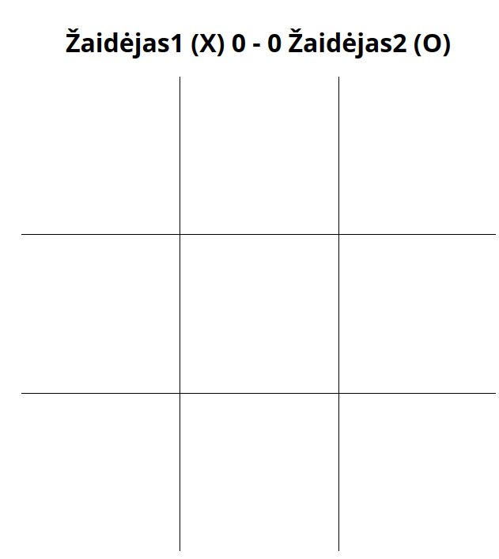

# Kryžiukai-nuliukai

## Nielsen euristikos principai:

### Prevent errors

Present users with a confirmation option before they commit to the action.

### Be consistent

Pvz. visi mygtukai, inputai yra vienodi. Visur yra naudojamas vienodas šriftas.

### Minimize user memory load

Vartotojas visada mato žaidimų rezultatą

### Aesthetic and minimalist design

Vartotojas mato tik naudingą informaciją

